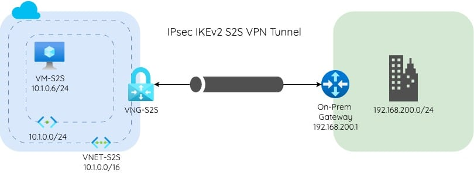
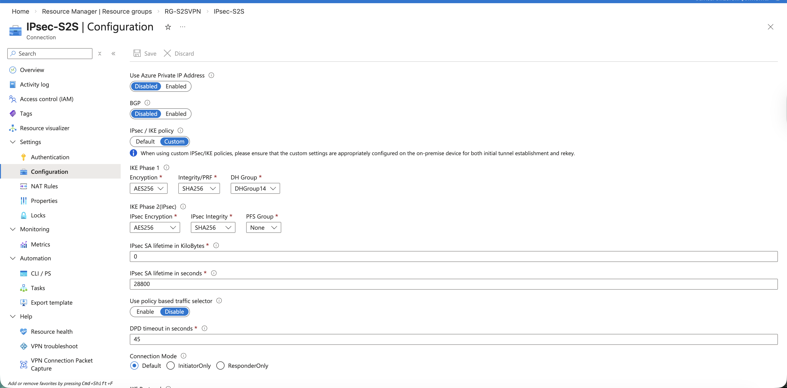
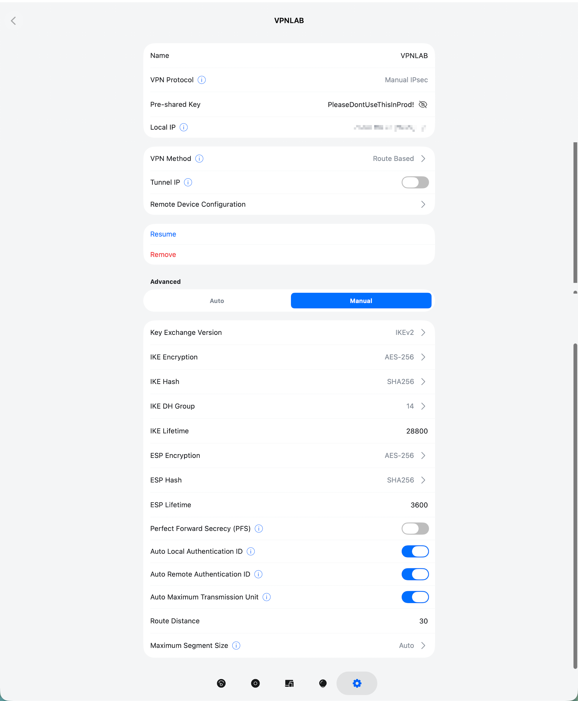
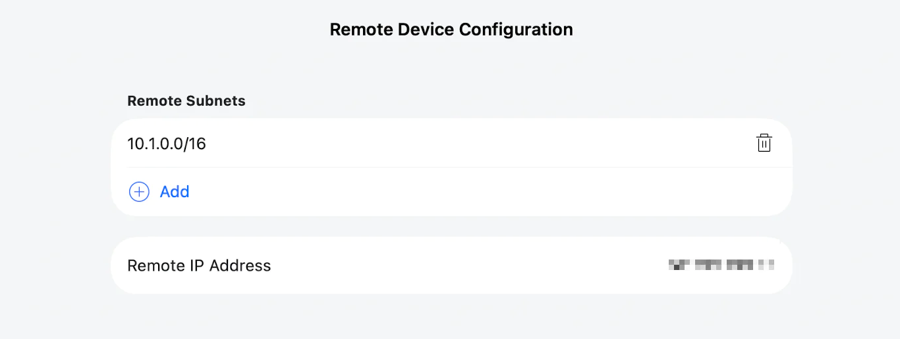
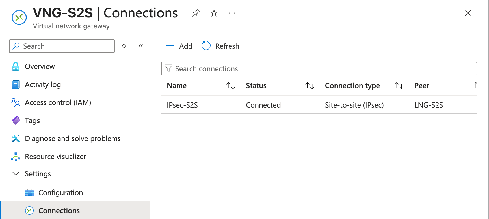
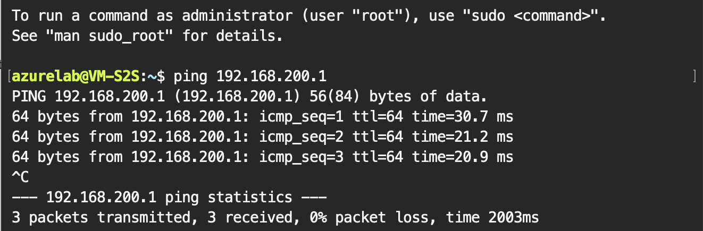



This lab will focus on creating a secure site-to-site VPN that can be used as a cost-saving option for branch offices, hybrid cloud connectivity, or centralizing resources securely without exposing them to the public internet. By the end of this lab, you will understand how to connect your local site to your Azure cloud environment using the topology below.

        
    

**Prerequisites:**
- Router or Firewall On-Site (Home)
- A <a href="https://azure.microsoft.com/en-us" target="_blank">Microsoft Azure Account</a>
- A computer with internet access
- Some knowledge about Routers and IP’s
- Shell/Terminal (optional)

<wa-callout>
  <wa-icon slot="icon" name="circle-info"></wa-icon>
  If you do not have a static IP, you might want to consider using a service like noip (DDNS) so you can use a fully qualified domain name rather than your WAN IP, since ISPs utilize dynamic IPs. This is not a requirement, but it might be helpful if you plan to utilize this outside this lab.
</wa-callout>

## Azure Configuration

Now onto the fun parts. Create a Resource group in your desired region (make sure this stays the same throughout the lab) called RG-S2SVPN.

Next, we will create a **Virtual Network Gateway** with the following settings:
- **Name:** VNG-S2S (or your preference)
- **Region:** West US (same region as your Resource Group)
- **SKU:** VpnGW1AZ (enough for lab purposes)
  - **Name:** VNET-S2S
  - **Resource Group:** Point to the one created in the previous step
  - The default network and subnet are fine (unless you are using overlapping space for your home/remote site, if you’re not sure your probably fine)
  - Click OK to create the network
- **Virtual Network:** Create a virtual network
- **Gateway subnet:** leave as default (10.1.1.0/24)
- **Public IP address:** Create New
- **Public IP address name:** VNG-PublicIP
- **Enable active-active mode:** Disabled
- **Configure BGP:** Disabled
- Click Review + create

<wa-callout>
  <wa-icon slot="icon" name="circle-info"></wa-icon>
  Deploying a Virtual Network Gateway can take some time, so we'll move along and check back with deployment towards the end.
</wa-callout>

Next, we are going to make a VM on our Azure side. We will use this later to confirm that our tunnel is working correctly and that our on-site and cloud resources can securely communicate over the internet.

Navigate to your Resource group we created for this lab, then hit +Create, search for Virtual Machine, and hit Create.

**Virtual Machine Settings:** 
- **Basics**
  - **Resource Group:** RG-S2SVPN
  - **Virtual Machine name:** VM-S2S
  - **Region:** West US (make sure this is the same across all resources made in this lab)
  - **Image:** Ubuntu Server 24.04 LTS
  - **Size:** Standard_B1s-1vcpu, 1Gib (free service eligible, to keep cost down)
  - **Authentication type:** Password (for lab purposes only)
  - **Username:** azurelab
  - **Password:** thisisaverystrongpassword123!
  - **Public inbound ports:** Allow selected ports
  - **Select inbound ports:** SSH
- **Disks**
  - Standard SSD
- **Networking**
  - **Virtual network:** Vnet-S2S
  - **Subnet:** default
  - **Public IP:** leave as is, should be (new) VM-S2S-ip
- Select Review + create

Next, we create a Local Network Gateway, which acts as a pointer to your on-premises gateway/firewall. Navigate to your lab resource group, then hit Create, then search for Local network gateway and select it.

**Local Network Gateway Settings:**
- **Basics**
  - **Resource Group:** RG-S2SVPN
  - **Region:** West US (or match)
  - **Name:** LNG-S2S
  - **Endpoint:** IP or FQDN (if you use a DDNS service like noip, you can use a FQDN; if not, you need to use an IP address)
  - **IP address:** your on-site public ip (usually found on router WAN, or you can find it by using something like [ipchicken](https://www.ipchicken.com/), just note this might change)
  - **Address Space(s):** 192.168.200.0/24 (Note: this may be different for your environment; most homes default to 192.168.1.0/24. Make sure to adjust for your specific address space.)
- Review + Create

## Connection Creation
We’re almost there; all we need to do is connect our cloud infrastructure to our on-site infrastructure. We start by, you guessed it Creating a connection. Select Create from your resource group and search for a connection, then select.

**Create Connection Settings:**
- **Basics**
  - **Resource Group:** RG-S2SVPN
  - **Connection Type:** Site-to-site (IPsec)
  - **Name:** IPsec-S2S (or whatever you'd like)
  - **Region:** West US (or match)
- **Settings**
  - **Virtual network gateway:** VNG-S2S
  - **Local network gateway:** LNG-S2S
  - **Authentication Method:** Shared Key (PSK)
  - **Shared Key(PSK):** PleaseDontUseThisInProd!
  - **IKE Protocol:** IKEv2
  - **Connection Mode:** Default
- Review + Create, then Create.

Once the connection is created, access the resource, and we will adjust some settings to harden it a bit. Goto settings, then configuration. Change the IPsec / IKE policy to custom, then match these configurations:

        
    

<wa-callout>
  <wa-icon slot="icon" name="circle-info"></wa-icon>
   Make sure these configurations match your on-prem device in the next step.
</wa-callout>

## On-Site Configuration
This will differ if using a device other than a UniFi gateway device, but I will do my best to explain the concepts along the way, which should translate across devices.

Create a new network; this will be the private network used to communicate with your cloud environment. In my example, I used the 192.168.200.0/24 address space. When creating this network, ensure it does not overlap with the address space configured in the cloud. If you followed along, that would be 10.1.0.0/16 space, so we’re all set here.

The key details for configuration are the following:

- **VPN Protocol:** Manual IPsec (note: this protocol needs to match the protocol defined in Azure)
- **Pre-shared Key:** PleaseDontUseThisInProd! (note: This was also configured in Azure, make sure these match and are very strong, and please dont use this lab one in production.)
- **VPN Method:** Route-Based 
- **Remote Subnet:** 10.1.0.0/16 (note: This is the subnet or address space you set up in Azure in earlier steps. You may need to use the gateway subnet depending on your router/firewall, but the entire space worked well for the UniFi gateway.)
- **Remote IP Address:** The public IP address associated with the Azure Virtual Network Gateway VNG-S2S (VNG-PublicIP).
- **Local IP:** This is your on-site public IP address (WAN). If you are unsure, you can use [ipchicken](https://www.ipchicken.com/) 
- **Advanced Options:**
  - **Key Exchange:** Select IKEv2
  - **Hash:** SHA256
  - **IKE DH Group:** 14

<wa-details summary="If you are on UniFi, feel free to check your configs against mine.">
        
        
</wa-details>

Once you are done, verify the connection by going to Azure and checking the IPsec-S2S connection status (you can also check this under settings/connections on the VNG-S2S).

        
    

If you really want to understand how cool this is, navigate to the VM-S2S deployed earlier, open the Connect Tab, and select Connect. Open your favorite terminal and copy/paste the ssh code provided by Azure into your local shell.

When prompted to continue connecting, type yes, then paste the password created in the previous VM step (thisisaverystrongpassword123!). You are now in your cloud VM. Now, ping a device on the local network you created the tunnel with (192.168.200.1). If your pings are successful, congratulations, you just created a secure tunnel over the internet and created a foundational component to a hybrid environment. 

        
    

Feel free to tinker with your new secure tunnel, maybe install traceroute and give that a try to see how your packets traverse or check out monitoring on the Azure side, the world is yours to explore!

## Troubleshooting
I came across a few issues when configuring the connection, below are some steps that can be useful for troubleshooting your site-to-site VPN.

- UniFi Specific Issue I ran into
  - I had to provision the VPN over the web, not the local app. It was not letting me create a VPN without a server locally, but it was able to do so from the web interface
  - Ensure PFS is disabled. I was getting inconsistent results with that turned on
- Connection Reset. If the connection is unknown and your are 100% sure you have configured eveything correctly navigate to the connection, scroll down to help then select reset. This will reset/retry the vpn connection. If this doesn't work, verify all other items check out.
- Verify the Azure Public and ISP Address is correct. If you don't have a static IP, it’s possible your Public IP changed while going through the lab steps. Check [ipchicken](https://www.ipchicken.com/) and verify the IPs match.
- Verify your cloud network and local network IP space does not overlap

## Cleanup
Once you are done tinkering, be sure to delete your resource group to avoid any costly bills. Hope you enjoyed this one and learned something valuable in this lab. 🙌