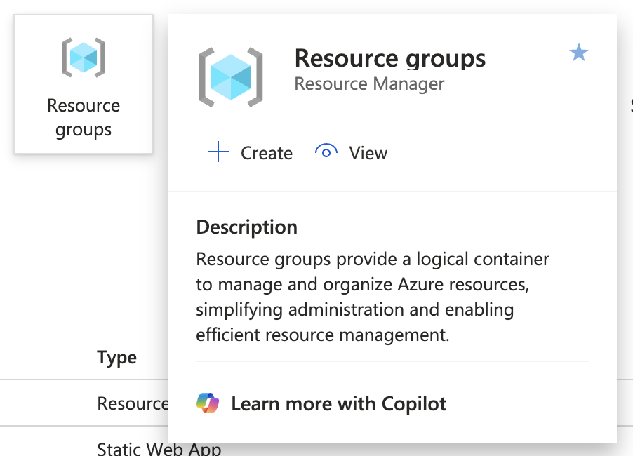
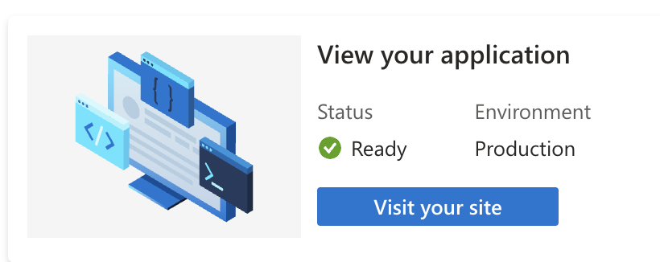


While studying for the AZ104 I came across static web apps and thought, this would be perfect for hosting my personal site, and it’s free! So I decided to move my personal site off my self hosted solution and get it up and running on Azure. I’ll walk you thorugh the steps, on how to get up your first static site with this fun lab.

Prerequisites:
- A <a href="https://github.com/" target="_blank">GitHub</a> account
- A <a href="https://azure.microsoft.com/en-us" target="_blank">Microsoft Azure Account</a>
- IDE or Text Editor (optional)
## Step 1
Log into your Github account then fork this repo to your account <a href="https://github.com/antoes/azureLabs" target="_blank">antoes/azureLabs: Static web application lab</a>. We will use this later in our CI/CD pipeline (it’s much easier than it sounds). 
## Step 2
Log into your your Microsoft Azure Account and create a resource group for you project, this will allow you to contain your lab in a nice little container for all your resources and spin them down at once when you complete the lab.
    

        
    

## Step 3
Jump into the resource group you just created, then hit the blue create button inside of the resource group. Seach for “static web app” then select and create, fill out the fields below.
- **Name:** enter a original name here.
- **Plan type:** Free: For hobby or personal project
- **Source:** GitHub
- **GitHub account:** Log in with the account you setup in step 1
- **Organization:** your GitHub account
- **Repository:** azureLabs (or the one you changed it to)
- **Branch:** main
- **Build Presets:** Custom (this should be automatically detected)
- **App location:** ./static-web-app-lab ( this should be auto filled also)
Then hit review + create.
## Step 4
Give it some time to deploy then once the resource is ready select view your site. Congratulations, you have just created your first static web app! 🎉
    

            
    

## Optional (but fun!)
If you are feeling adventurous try editing some of the html from your forked repository with your favorite IDE or editing it directly on the web and watch your CI/CD pipeline in action. Once changes are comitted to your main branch your static website will update automatically! 

## Cleanup
Once your done exploring your new static web app goto your resource group and delete the whole group (this will delete anyhting inside that resource group).

I hope you learned something valuable on this one! If you have any questions, get hung up, or just wanna say hi feel free to drop me a message!