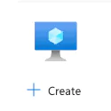



## Creating the VM

Create a Virtual Machine, this will create all the required resources for the VM makle sure to use the following in the basics tab:

<div class="wa-frame" slot="media" style="min-height: 50px; max-height: 100px; aspect-ratio: 1:1;">
        
</div>

- **Resource Group:** rg-yout-vm-lab-12323
- **Virtual machine name:** yourvmname
- **Region:** West US 2
- **Zone Options:** Azure-selected zone (preview)
- **Image:** Ubuntu Server 24.04 LTS
- **VM architechture:** x64
- **Size:** Standard_B1 - 1vcpu, 1GiB memory (free service eligible)
- **Authentication type:** SSH public key
- **Username:** labDemo
- **Allow selecterd ports:** SSH (22)

The other tabs can be left as default, then select Review + create. You will be prompted here, or after create to download your private key, make sure to download this and save it to a location that is easily accessible, once downloaded your VM will begin to spin up out of thin air! Once deployment is done, head over to the resource group you defined earlier and look at all the VM resources that have spun up! you should have the following items in your resource group:
- Virtual machine
- Public IP address
- Network security group
- Virtual network
- Network interface
- SSH key
- Disk

Pretty sweet, right? 
## Check out your VM
Click ino the virtual machine resource and check out the overview tab for a bit. Once your have taken a mental snapshot look under the netowking section and notice the public IP address. Copy that address, then open up a terminal on your computer and try pinging that address, it should time out and you shouldent have access to ping it, any guesses on why? 
<div class="wa-frame" slot="media" style="min-height: 150px; max-height: 500px; aspect-ratio: auto;">
        
</div>
Head back to your lab resource group, then select the Network security group and take a look at the inbound and outbound rules. We have only allowed SSH so far, ICMP is not allowed. Let’s make that change. Select the Settings blade then select inbound rules, then hit add. Under Protocol select ICMPv4 then name it AllowICMPv4In (make sure these are descriptive), and change the destination port ranges to * (lab use only!), then select save. Then repeat on the outbound rules, since we will need to get a response. Make sure the name is AllowICMPv4Out, for the outbound rule. Confirm your overview looks something like this:
<div class="wa-frame" slot="media" style="min-height: 150px; max-height: 500px; aspect-ratio: auto;">
        
</div>

Now try the ping on your public address now, the new NSG rules should allow the pings. You are successfully comunicating with your cloud VM from your local machine, how cool is that?

<div class="wa-frame" slot="media" style="min-height: 150px; max-height: 500px; aspect-ratio: auto;">
        
</div>

The next bits are optional, but just as fun if your want to get a bit more hands on with some SSH and getting a basic web server up on your new cloud VM.

## Set Permissions (Linux/macOS only)
The private key file must have restrictive permissions for security.
```
chmod 400 /path/to/your-private-key.pem
```
## Connect via SSH
Open your terminal and run the following command, replacing the placeholders with your specific details:
```
ssh -i /path/to/your-private-key.pem labDemo@your_public_ip_address
```
- **-i** **flag:** Specifies the path to your identity file (private key).
- **your_username**: The admin username for the Azure VM (labDemo if following along)
- **public_ip_address**: The public IP address of your Azure VM.

## First-time Connection
When connecting for the first time, you may be prompted to confirm the host's authenticity. Type yes and press Enter to continue. If you set a passphrase for your key, enter it when prompted. Now your actually in your machine from your local machine. Next we will setup a simple static web server.

## Install Apache

<div class="wa-flank:start">
    <pre>sudo apt update</pre>
    <wa-copy-button value="sudo apt update"></wa-copy-button>
</div>

<div class="wa-flank:start">
    <pre>sudo apt install apache2 -y</pre>
    <wa-copy-button value="sudo apt install apache2 -y"></wa-copy-button>
</div>

Verify the Install of apache

<div class="wa-flank:start">
    <pre>sudo systemctl status apache2</pre>
    <wa-copy-button value="sudo systemctl status apache2"></wa-copy-button>
</div>

Once verified were almost there! We will need to head back to the Azure portal then select your network security gateway (NSG). We need to add some more security rules to allow the HTTP requests. 
## Final Rules
Head to the Settings blade of your network security group and add a new inbound rule, change the Service to HTTP and allow. Name this rule AllowHTTPIn. Next do the outbound seurity rule, select HTTP for ther service then name it AllowHTTPOut. This should looks like your rules list from the Overview section:

<div class="wa-frame" slot="media" style="min-height: 150px; max-height: 500px; aspect-ratio: auto;">
        
</div>

Now select your public IP address and paste it in a browser, you should be met with something like this:

<div class="wa-frame" slot="media" style="min-height: 150px; max-height: 512px; aspect-ratio: 1:1;">
        
</div>

🎉 Congratulations you just made a Cloud VM that hosts static websites via apache2, from pretty much thin air.

## Cleanup
Once you are done with the project don’t forget to clean everything up to avoid any exorbant charges or usage on your account. The quickest and easiest way to do this is go to delete your resource group, all the items in the resource group will be deleted all at once.

Last note, these configurations are only for demo purposes and for undestanding concepts at a base level, please do not use these configurations for anything outside of labbing. I hope you learned something and enjoyed this project. 
