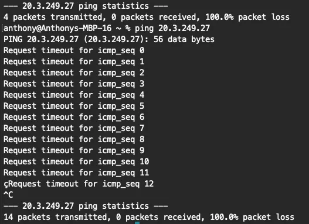
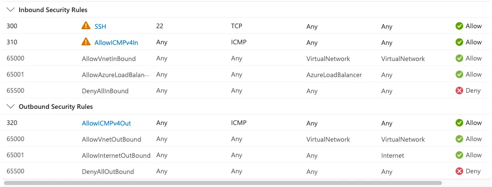
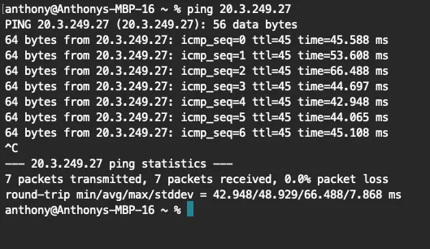
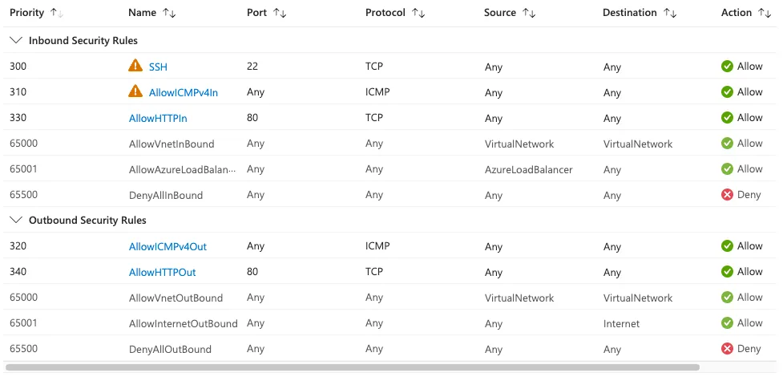
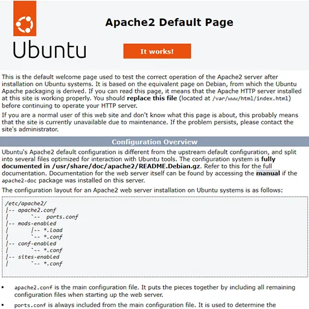



I wanted to create a lab that covers the basics of VM creation in Microsoft Azure. This lab will cover VM creation, some network security groups, basic network commands, and finish with a static web server allowing your VM to be accessed from a public IP.

**Prerequisites:**
* A <a href="https://azure.microsoft.com/en-us" target="_blank">Microsoft Azure Account</a>
* A computer

## Creating the VM

Create a Virtual Machine; this will create all the required resources for the VM. Make sure to use the following in the basics tab:

- **Resource Group:** rg-yout-vm-lab-12323
- **Virtual machine name:** yourvmname
- **Region:** West US 2
- **Zone Options:** Azure-selected zone (preview)
- **Image:** Ubuntu Server 24.04 LTS
- **VM architecture:** x64
- **Size:** Standard_B1 - 1vcpu, 1GiB memory (free service eligible)
- **Authentication type:** SSH public key
- **Username:** labDemo
- **Allow selecterd ports:** SSH (22)

The other tabs can be left as default, then select Review + create. You will be prompted to download your private key here, or after creating it. Make sure to download this and save it to a location that is easily accessible. Your VM will begin to spin up out of thin air! Once deployment is complete, head over to the resource group you defined earlier and check all the VMs that have spun up! You should have the following items in your resource group:
- Virtual machine
- Public IP address
- Network security group
- Virtual network
- Network interface
- SSH key
- Disk

Pretty sweet, right?
## Check out your VM
Click into the virtual machine resource and check out the overview tab for a bit. Once you have taken a mental snapshot, look under the networking section and notice the public IP address. Copy that address, then open a terminal on your computer and try pinging it. It should time out, and you shouldn’t have access to ping it. Any guesses on why?  

        

Head back to your lab resource group, then select the Network security group and take a look at the inbound and outbound rules. We have only allowed SSH so far; ICMP is not allowed. Let’s make that change. Select the Settings blade, then select Inbound Rules, then hit Add. Under Protocol, select ICMPv4, then name it AllowICMPv4In (make sure these are descriptive), and change the destination port ranges to * (lab use only!), then select save. Then repeat for the outbound rules, since we need a response. Make sure the outbound rule name is AllowICMPv4Out. Confirm your overview looks something like this:

        

Now try pinging your public address; the new NSG rules should allow it. You are successfully communicating with your cloud VM from your local machine. How cool is that?

        

The next bits are optional, but just as fun if you want to get a bit more hands-on with SSH and set up a basic web server on your new cloud VM.

## Set Permissions (Linux/macOS only)
The private key file must have restrictive permissions for security.

<pre>chmod 400 /path/to/your-private-key.pem</pre>

## Connect via SSH
Open your terminal or Command Prompt and run the following command, replacing the placeholders with your specific details:

<pre> ssh -i /path/to/your-private-key.pem labDemo@your_public_ip_address</pre>

- **-i** **flag:** Specifies the path to your identity file (private key).
- **your_username**: The admin username for the Azure VM (labDemo if following along)
* **public_ip_address**: The public IP address of your Azure VM.

## First-time Connection
When connecting for the first time, you may be prompted to confirm the host's authenticity. Type yes and press Enter to continue. If you set a passphrase for your key, enter it when prompted. Now you’re actually in your machine from your local machine. Next, we will set up a simple static web server.

## Install Apache

    <pre>sudo apt update</pre>
    <wa-copy-button value="sudo apt update"></wa-copy-button>

    <pre>sudo apt install apache2 -y</pre>
    <wa-copy-button value="sudo apt install apache2 -y"></wa-copy-button>

Verify the Install of apache

    <pre>sudo systemctl status apache2</pre>
    <wa-copy-button value="sudo systemctl status apache2"></wa-copy-button>

Once verified were almost there! We will need to head back to the Azure portal, then select your network security gateway (NSG). We need to add some more security rules to allow the HTTP requests. 

## Final Rules
Head to the Settings blade of your network security group, add a new inbound rule, set the Service to HTTP, and allow. Name this rule AllowHTTPIn. Next, do the outbound security rule, select HTTP for the service, then name it AllowHTTPOut. This should look like your rules list from the Overview section:

        

Now select your public IP address and paste it in a browser, you should be met with something like this:

        

🎉 Congratulations you just made a Cloud VM that hosts static websites via Apache2, from pretty much thin air.

## Cleanup
Once you are done with the project, don’t forget to clean up everything to avoid exorbitant charges or excessive usage on your account. The quickest and easiest way to do this is to delete your resource group; all its items will be deleted at once.

Last note: these configurations are only for demo purposes and for understanding concepts at a base level; please do not use them for anything outside of labbing. I hope you learned something and enjoyed this project. 