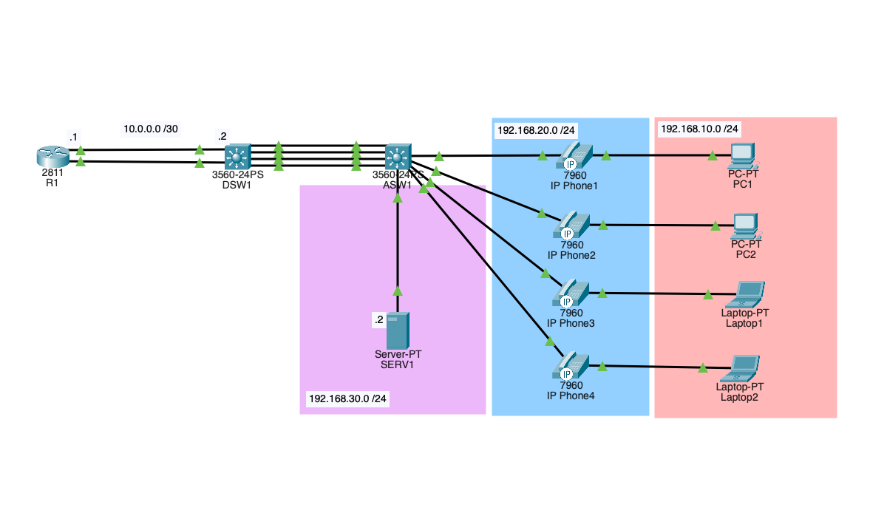



This lab covers a pretty solid chunk of CCNA-related material, along with a couple of topics that aren't covered that much. This is one I'd tackle maybe around the halfway mark of your studies, but if you're up for a challenge and want to learn, this is the one for you! I personally haven't seen any labs that put these ideas together like this, so I really hope you enjoy this one. Below is a list of topics covered, along with some pre-reqs.

**Difficulty:** 7/10

**Topics Covered:** VLANs, Trunking, PoE, VoIP, SVI's, DHCP, CME, Subnetting, EtherChannels, and OSPF.

**Pre-Reqs:**
- <a href="https://www.netacad.com/cisco-packet-tracer" target="_blank">Cisco Packet Tracer</a>
- Computer
- Basic/Intermediate knowledge of networking (some CCNA studies)
- Cisco IOS CLI commands (? is your friend)

Below is the unconfigured starting point for this lab. If you get stuck, I'll have a completed version of this lab at the end of this post, along with some troubleshooting tips.

<wa-button size="large" appearance="filled-outlined" variant="neutral" href="./VOIP-Lab-Start.pkt">
  <wa-icon slot="start" name="download"></wa-icon>
  VOIP-Lab-Start.pkt
</wa-button>

<div class="wa-frame" style="min-height: 100px; max-height: 500px; aspect-ratio: auto;">
  
</div>

This is the topology we will be deploying. Quick heads-up: the access switch is Layer 3-capable, but we're only using it that way to get PoE working in Packet Tracer. In the real world, this would typically be a Layer 2 device, so don't let that throw you off. This isn't a step-by-step configuration guide; the goal is to get your brain juices flowing. I'll drop some hints along the way in dropdowns, but try to struggle through it first before peeking! Lastly, if you forget commands, try using the `?` to troubleshoot your way through. This is hands down the best way to get these commands to stick and speed up your CLI skills.

## ASW1 Configuration
Start at the access layer and work your way up. Get your VLANs and ports sorted here before touching anything else.

1. Create VLANs 10, 20, 30, and 99 — name them DATA, VOICE, SERVERS, and NATIVE respectively
2. Configure Fa0/1 through Fa0/5 as access ports on VLAN 10 with VLAN 20 as the voice VLAN
3. Configure Fa0/6 as an access port on VLAN 30 for the server
4. Create a Layer 2 EtherChannel using four interfaces for the uplink to DSW1, then trunk it up, allow VLANs 10, 20, and 30, and set VLAN 99 as the native VLAN

<wa-card>
    <strong>💡Hints</strong>
        <div class="wa-stack">
            <wa-details appearance="plain">
<p slot="summary">Commands Used</p>                
<pre>
vlan
name
interface
switchport
channel-group
show vlan brief
show etherchannel summary
</pre>
            </wa-details>
        </div>
</wa-card>

<wa-divider></wa-divider>

## DSW1 Configuration
Now that ASW1 is good to go, head up to the distribution layer. This is where all the routing magic happens, so take your time here.

1. Enable IP routing — don't forget this one, it'll drive you crazy if you do
2. Create a loopback address for DSW1; this is used as a router ID for OSPF (I used 2.2.2.2)
3. Create VLANs 10, 20, 30, and 99 — use the same names as ASW1
4. Create a Layer 2 EtherChannel using four interfaces for the downlink to ASW1, and match the trunk config on ASW1 exactly
5. Create a Layer 3 EtherChannel using two interfaces for the uplink to R1 and assign the appropriate IP address
6. Create SVIs for VLANs 10, 20, and 30 and assign the appropriate gateway IP
7. Configure the DHCP relay on the data and voice SVIs pointing to the server outlined in the topology
8. Configure OSPF and advertise all appropriate networks, including your loopback

<wa-card>
    <strong>💡Hints</strong>
        <div class="wa-stack">
            <wa-details appearance="plain">
                <p slot="summary">EtherChannel between DSW1 and ASW1</p>
                The EtherChannel between DSW1 and ASW1 uses PAgP, but feel free to use LACP. Just ensure both sides use the same protocol and are set up appropriately. Make sure the trunk and VLAN configs match on both sides before bringing it up.
            </wa-details>
            <wa-details appearance="plain">
                <p slot="summary">EtherChannel between DSW1 and R1</p>
                Remember, this is a Layer 3 EtherChannel; configurations are a bit different, but the concepts are similar. This channel group will require routing; ensure the switch ports are configured accordingly.
            </wa-details>
            <wa-details appearance="plain">
                <p slot="summary">Inter-VLAN routing not working?</p>
                This one gets everyone at least once — don't forget `ip routing` on DSW1. It's a switch, so Layer 3 forwarding is off by default. Without it your SVIs will have IPs but won't actually route anything between VLANs.
            </wa-details>
            <wa-details appearance="plain">
                <p slot="summary">DHCP Relay</p>
                This one gets people tripped up — ensure you set up the `ip helper-address` on each SVI that will be using DHCP (DATA & VOICE) and point it to your DHCP server. In this lab it's the server in VLAN 30.
            </wa-details>
            <wa-details appearance="plain">
                <p slot="summary">Commands Used</p>
<pre>
ip routing
vlan
name
interface
switchport
no switchport
channel-group
ip address
ip helper-address
router ospf
network
show ip route
show ip ospf neighbor
</pre>
            </wa-details>
        </div>
</wa-card>

<wa-divider></wa-divider>

## Server Configuration
Short and sweet, just need to get DHCP sorted for both the data and voice VLANs.

1. Configure the server with a static IP address and assign the appropriate gateway address
2. Configure a DHCP pool for the data VLAN and set the default gateway to DSW1's VLAN 10 SVI
3. Configure a DHCP pool for the voice VLAN, then set the default gateway to DSW1's VLAN 20 SVI and point the TFTP server to R1's loopback (this will be 1.1.1.1)
4. Exclude the gateway addresses from both pools so they don't get handed out to clients

<wa-card>
    <strong>💡Hints</strong>
        <div class="wa-stack">
            <wa-details appearance="plain">
                <p slot="summary">Server Configuration</p>
                Server configuration is done via the PT GUI, not the CLI. Use the Services tab on the server to add your DHCP pools.
            </wa-details>
            <wa-details appearance="plain">
                <p slot="summary">TFTP Server field</p>
                In Packet Tracer's server DHCP GUI, the "TFTP Server" field serves the same function as DHCP Option 150. This is what tells the phones where to download their config and where to register. Set it to R1's loopback (1.1.1.1) in the voice pool — without this, your phones will get an IP but won't register with CME (R1's telephony service).
            </wa-details>
            <wa-details appearance="plain">
                <p slot="summary">Static IP and Gateway</p>
                This server needs a static IP address and an appropriate gateway to enable inter-VLAN communication. The gateway address in this case is the SVI in VLAN 30 on DSW1.
            </wa-details>
        </div>
</wa-card>

<wa-divider></wa-divider>

## R1 Configuration
Last stop, the router. This is where we tie everything together with OSPF and get CME up and running for the phones.

1. Create a loopback address (1.1.1.1) — this will be used for both OSPF and CME
2. Create a port channel with two interfaces and assign the appropriate IP address to the port channel
3. Configure OSPF and add the appropriate networks
4. Enable telephony-service and configure a max of 5 ephones and 5 dns
5. Set the CME source address to your loopback and enable auto assign
6. Configure 4 ephone-dns with extension numbers 101–104
7. Configure 4 ephones, assign each one a MAC address and map it to its ephone-dn

<wa-card>
    <strong>💡Hints</strong>
        <div class="wa-stack">
            <wa-details appearance="plain">
                <p slot="summary">Commands Used</p>
<pre>
interface 
Loopback0 
ip address 
interface 
Port-channel 
channel-group
router ospf
network
telephony-service
ip source-address
auto assign
ephone-dn
number
ephone
mac-address
type
button
show ephone 
</pre>
            </wa-details>
        </div>
</wa-card>

<wa-divider></wa-divider>

## Verification
Alright, let's see if it all works. Pick up one of the phones in PT and dial another extension. If the call connects, you nailed it. If not, it's time to troubleshoot. Below are some troubleshooting ideas, as well as the completed file to cross-reference, but try troubleshooting it without first.

**On ASW1 and DSW1:**
```
show vlan brief
show etherchannel summary
```

**On DSW1:**
```
show ip ospf neighbor
show ip route
```

**On R1:**
```
show ip ospf neighbor
show ip route
show ephone
```

## Troubleshooting and Issues Faced
When building this out, I ran into a couple of issues initially. I wanted to share issues I had come across.

- **Missing helper-address on DATA SVI:** I missed configuring the IP helper-address on my DATA SVI on DSW1. I was getting IPs on my phones, but nothing on my PCs. Looked over the running config and saw I had omitted the helper-address on VLAN 10.
- **Phones not getting numbers:** Ensure the telephony service IP points to R1’s loopback address, where the service lives, and ensure the DHCP server’s TFTP server points to R1's loopback.
- **EtherChannel bundling issue:** I had a duplex mismatch on one of the ports in the bundle, which caused an error. I had to manually fix the switchport to ensure full duplex on all ports on both sides.
### Other Troubleshooting Tips
- **Check your VLANs**: ensure all VLANs match, and that trunks allow the appropriate VLANs.
- **L3 EtherChannel:** Verify that configurations are created on the port channel, not on the interfaces; it's easy to accidentally configure a single port.
- **L2 EtherChannel:** Same note as L3, but also ensure that the appropriate VLANs are enabled on both sides. It's very easy to overwrite VLAN assignments. If you are adding VLANs, don't forget to use `add`; otherwise, you risk wiping all your prior assignments.
- This lab has no ACLs; you should be able to use ping and traceroute to troubleshoot and pinpoint issues.
- **Routing:** We rely on OSPF to handle a large portion of routing, ensure OSPF forms adjacencies, and ensure that routing tables contain all necessary routes, including loopback routes. R1's loopback can easily be overlooked when configuring OSPF in this lab.

<wa-button size="large" appearance="filled-outlined" variant="neutral" href="./VOIP-Lab-Competed.pkt">
  <wa-icon slot="start" name="download"></wa-icon>
  VOIP-Lab-Competed.pkt
</wa-button>
<br></br>
If you tried this lab or got hung up anywhere, please feel free to shoot me an email or leave a message below! The comments section is a newer feature. I would love to hear your thoughts on the feature and the lab!
